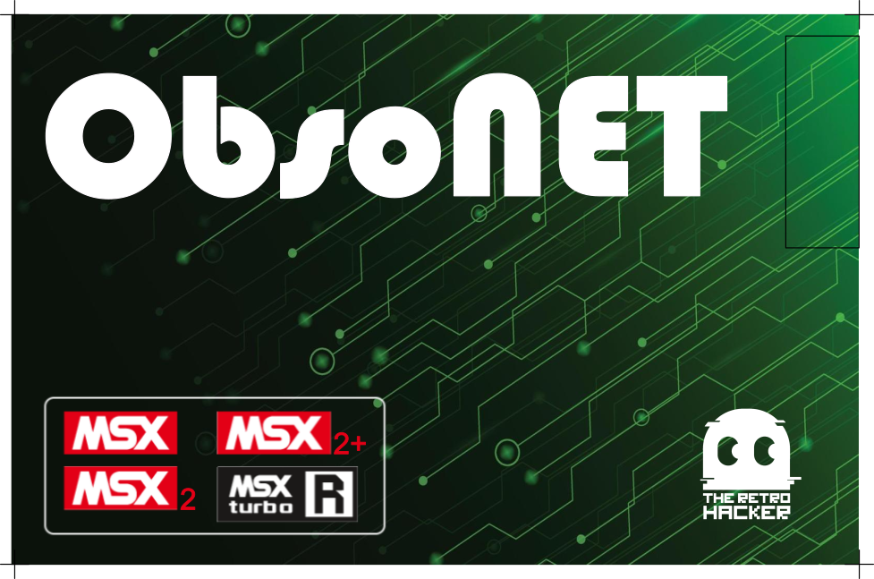
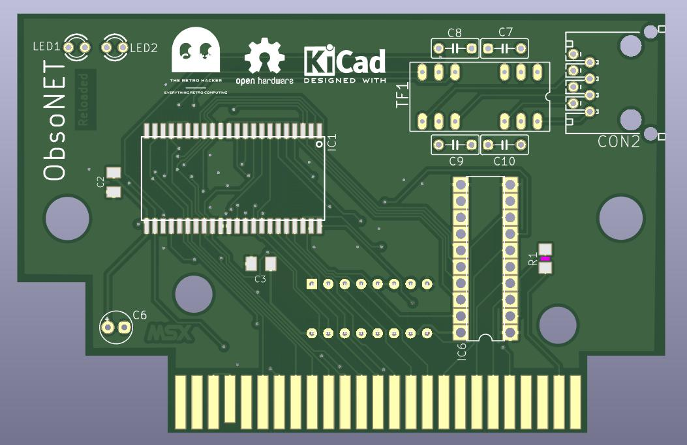
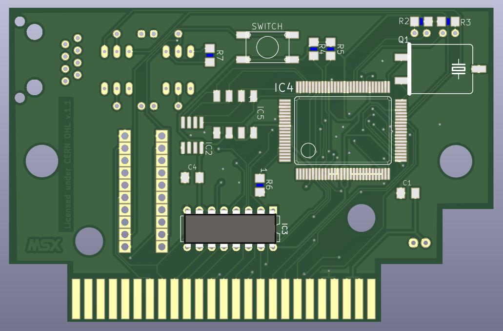

# Obsonet Reloaded

This is the GitHub repository to host all source files for the Obsonet Reloaded. 

The ObsoNET is the first network card created for the MSX. In 2004, the hardware designer Daniel Berdugo and software developer Nestor Soriano joined forces to create a cartridge to bring ETHERNET standard to the MSX line of computers. 

The cartridge is based on the Realtek RTL8019AS chip and uses a flash memory to host and execute a BIOS that allows the use of network commands from the Nextor operating system (compatible with MSXDOS). An EPROM stores basic configuration data for the RTL8019AS chip and a side connector is used to plug a network cable to your MSX. A GAL16VB is used to implement the logic required to activate and expose the cartridge to the computer.

The original version of the Obsonet was designed to fit a standard Konami cartridge case. The goal of this project is to create a new version of the cartridge that fits the standard Patola cartridge case available in Brazil as well as the standard Konami cases available from multiple vendors WW.

## Hardware 

### PCB

The files required to build the original version of the Obsonet are available [https://github.com/msx-solis/obsonet](here). You can download the gerber files and order from any PCB manufacturer.

I have created another version of the PCB that I called Obsonet Reloaded. The goal was to have the board fitting the standard Patola cartridge cases available in Brazil as well as the standard Konami cases available from multiple vendors WW.

### Bill of Materials

[Obsonet Reloaded Interactive BOM](https://htmlpreview.github.io/?https://github.com/cristianoag/obsonet/blob/main/hardware/bom/ibom.html)

| Reference | Value    | Description         | Package                  | Qtd | Link                                                                                         |
|-----------|----------|---------------------|---------------------------|-----|----------------------------------------------------------------------------------------------|
| C1-C4     | 100nF    | C-EUC1206K          | C1206                     | 4   | [Ali Express](https://s.click.aliexpress.com/e/_DmIukoX)                                    |
| C6        | 100 uF   | CPOL-EUE2.5-5       | E2.5-5                    | 1   | [Ali Express](https://s.click.aliexpress.com/e/_DmAGIvh)                                    |
| C7-C10    | 10nF     | C-EU050-030X075     | C050-030X075              | 4   | [Ali Express](https://s.click.aliexpress.com/e/_Dmqpgbd)                                    |
| CON2      | RJ45_F   | 555153-1             | 555153-1                  | 1   | [Ali Express](https://www.aliexpress.com/item/1005004025349982.html?spm=a2g0o.order_detail.0.0.216a39d3pdK1F8) |
| IC1       | M29F400M | M29F400M             | SO44                      | 1   | [Ali Express](https://s.click.aliexpress.com/e/_Dd8KY1Z)                                    |
| IC2       | 93C46_SOIC | AT93CX6SOIC08      | SOIC8 (you only need one DIP8 or SOIC8) | 1*  | [Ali Express](https://s.click.aliexpress.com/e/_De08kgX)                                    |
| IC3       | 74HC133  | 74HC133             | DIP16                     | 1   | [Ali Express](https://s.click.aliexpress.com/e/_DeVHdHd)                                    |
| IC4       | RTL8019AS | RTL8019AS           | RTL8019AS                  | 1   | [Ali Express](https://s.click.aliexpress.com/e/_DD061Bp)                                    |
| IC5       | 93C46_DIL | AT93CX6DIP8         | DIP8 (you only need one DIP8 or SOIC8) | 1*  |                                                                                              |
| IC6       | GAL16V8D | GAL16V8D             | DIP20                     | 1   | [Ali Express](https://s.click.aliexpress.com/e/_DB7dHhf)                                    |
| LED1      | Green    | Led 3mm              | LED3MM                    | 1   | [Ali Express](https://s.click.aliexpress.com/e/_DeGtXFv)                                    |
| LED2      | Orange   | Led 3mm              | LED3MM                    | 1   | [Ali Express](https://s.click.aliexpress.com/e/_DeGtXFv)                                    |
| Q1        | 20MHz    | HC49GW/HC49U         | HC49GW/J (or you can adapt the conventional HC49U) | 1   | [Ali Express](https://s.click.aliexpress.com/e/_DDEOp47)                                    |
| R1,R4,R5  | 11K      | R-EU_R1206          | R1206                     | 3   | [Ali Express](https://s.click.aliexpress.com/e/_DF7KTEP)                                    |
| R2,R3     | 300R     | R-EU_R1206          | R1206                     | 2   | [Ali Express](https://s.click.aliexpress.com/e/_DF7KTEP)                                    |
| R6        | 27K      | R-EU_R1206          | R1206                     | 1   | [Ali Express](https://s.click.aliexpress.com/e/_DF7KTEP)                                    |
| R7        | 200R     | R-EU_R1206          | R1206                     | 1   | [Ali Express](https://s.click.aliexpress.com/e/_DF7KTEP)                                    |
| SW1       | SWITCH   | Microswitch 6×6     | 6×6 microswitch SMD       | 1   | [Ali Express](https://s.click.aliexpress.com/e/_DFJZR15)                                    |
| TF1       | 20F001N  | 20F001N             | DIL16/12                  | 1   | [Ali Express](https://s.click.aliexpress.com/e/_DCD6uDZ)                                    |

## Software

On this repo you can find all software required to build and use the Obsonet Reloaded. There are also binary files with fixes for small issues we found during the project.

### BIOS

The BIOS is the software that runs on the flash memory of the cartridge. It is responsible for initializing the hardware and providing a set of functions to the Nextor operating system.

## Resources

I wrote an article providing more information on how to acquire components and build the new version of the cartridge. You can check it on my blog at [http://www.theretrohacker.com/2022/11/04/the-obsonet-cartridge-for-the-msx/](http://www.theretrohacker.com/2022/11/04/the-obsonet-cartridge-for-the-msx/).

I also have a video in Portuguese showing the board, software, issues we faced during the remodel project as well as showing how to use it to download and use software on your MSX. Please check it at [https://www.youtube.com/watch?v=Ph_3VFheo2I](https://www.youtube.com/watch?v=Ph_3VFheo2I)

## License

This work is licensed under a [Creative Commons Attribution-NonCommercial-ShareAlike 4.0 International License](http://creativecommons.org/licenses/by-nc-sa/4.0/).

Original version build by Daniel Berdugo and Nestor Soriano. Reloaded version by Cristiano Goncalves. 

* If you remix, transform, or build upon the material, you must distribute your contributions under the same license as the original.
* You may not use the material for commercial purposes.
* You must give appropriate credit, provide a link to the license, and indicate if changes were made. You may do so in any reasonable manner, but not in any way that suggests the licensor endorses you or your use.

**ATTENTION**

This project was made for the retro community and not for commercial purposes. So only retro hardware forums and individual people can build this project.

THE SALE OF ANY PART OF THIS PROJECT WITHOUT EXPRESS AUTHORIZATION IS PROHIBITED!
